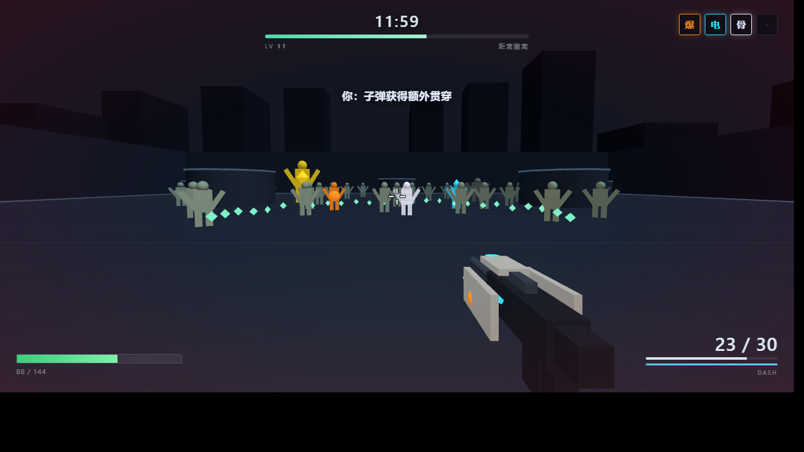
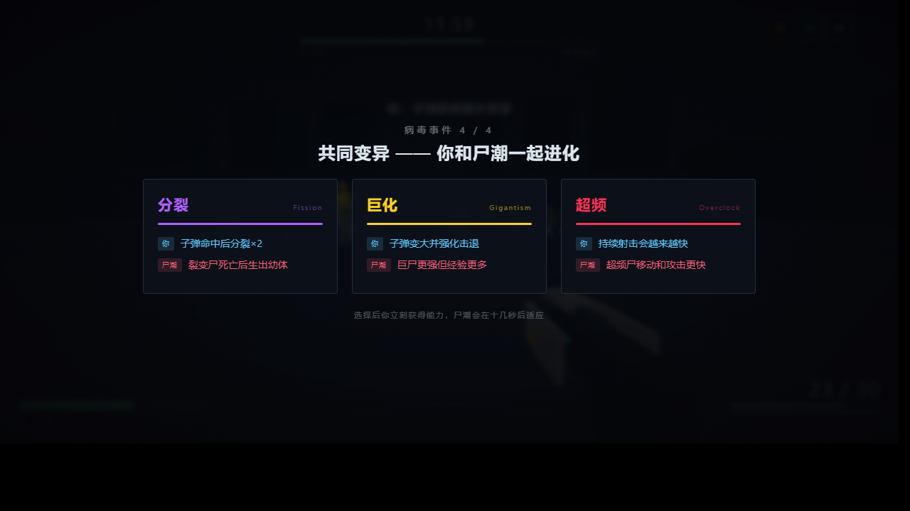

# SYMBIOTIC FIRE · 共生火力

12 分钟一局的第一人称幸存者原型。按《FPS 幸存者「共同进化」原型 · 设计与实现规格 v0.1》实现，**全新工程，未复用 VOID PROTOCOL 的任何玩法代码**（只复用了 three.js r147 运行库本身）。

> 喂养你的枪，也喂养尸潮。每次进化，你和丧尸一起变强。



## 玩

打开 `index.html` 即可（或 GitHub Pages 直接访问）。零资源文件，所有几何体、材质、音效均运行时生成。

| 操作 | 键 |
|---|---|
| 移动 | WASD |
| 瞄准 | 鼠标 |
| 射击 | 按住左键（弹药无限，打空自动换弹） |
| 换弹 | R |
| 冲刺 | Shift / 空格（带极短无敌帧） |
| 暂停 | Esc |
| 调试面板 | F1 |

> 浏览器偶尔会拒绝紧跟在三选一之后的指针锁定重申请。若鼠标失去控制，**点一下画面**即可恢复。

## 这一局在验证什么

> 玩家是否会为了一个非常想要的能力，主动接受一种会进入尸潮的麻烦。

所以两层升级是**分开**的：

- **普通改装**（经验升级，一局 20 次上下，三选一）——只强化你，纯奖励，维持爽感。
- **共同变异**（固定在 00:45 / 03:00 / 06:00 / 09:00，三选一）——你立刻获得能力，**10–15 秒后对应变种进入尸潮**。一局 4 种，另外 2 种不会出现。



卡面严格两句：<span>青蓝 = 你</span>，<span>红 = 尸潮</span>。数值只在悬停时展开。

六种共同变异：爆裂 / 分裂 / 超频 / 骨化 / 电导 / 巨化 —— 每种都有专属色、枪体器官、敌人轮廓与战斗表现，同一变异在卡牌、枪、敌人、特效上永远同色。

12:00 的尸王会**按生命阶段逐个学会你本局选过的四种变异**。

## URL 参数与调试（§36）

```
?seed=12345      固定种子（抽卡与生成序列可复现）
?debug=1         启动即开调试面板
?timescale=2     时间倍率
```

调试面板：无敌 G · 立即升级 L · 强制变异 M · 清怪 K · 跳转 3/6/9/12 分钟（数字键 3 6 9 0）· 强制生成任一变种 · 实时 FPS / 敌人数 / 子弹数 / 特效数 / 每帧触发次数 / 触发深度上限 / 变种占比。

## 实现范围

MVP（§37）已全部实现：竞技场、自动步枪、3 种基础敌人 + 冲撞精英 + 中期 Boss + 最终尸王、经验与吸附、两层三选一、**19 个普通改装**、**6 种共同变异的玩家侧与尸潮侧**、4 次固定变异事件、12 分钟完整单局、颜色映射与首只变种教学生成、触发递归保护、固定种子、调试面板、结算页。

§38「明确不做」的项目一律没做。

## 与规格不一致的地方（需要 Bao 裁决）

### 1. 经验曲线换成了动态节奏控制器（取代§29 的静态曲线）

静态经验曲线隐含一个不存在的“平均玩家”。实际上爆裂+分裂+电导 的清屏 build 与 骨化+巨化 的单体 build 吞吐相差 5–10 倍 —— **任何固定曲线只能服务其中一种**。这不是调参能解决的，是结构问题。

改成两层控制（Bao 提出的方向）：

**内层 · 自校准定价**。下一级的需求 = 你最近的经验速率 × targetInterval。关键在于**需求只在升级瞬间改变，而进度条那一刻正好归零，所以完全不可见**。（反过来，中途改需求会让进度条倒退 —— 绝对不做。）

**外层 · 漂移纠正**。期望等级 vs 实际等级，±1 级死区内完全不干预（**死区就是玩家能动性的保留区**），±4 级达满。补偿比压制慊慨（需求最低 45%，最高只到 180%），9:00 后压制淡出、10:00 完全放飞。

**巧在速率用长窗口（75 秒半衰期）**：短期打爆一波，需求还停在旧的低值上，你会真的升得快（波动保住）；长期 build 强度被窗口追上、归一化掉。一个机制同时给了“允许波动 + 纠正漂移”。

实测（当年 `testsim.js` 的 build 强度扫描，×0.25 到 ×8 共 **32 倍跨度**；
该脚本已并入 `testsim_evo.js`）：

| build 强度 | 升级次数 | 首次 | 平均间隔 |
|---|---|---|---|
| ×0.25 | 24 | 22s | 30.3s |
| ×1 | 24 | 21s | 29.5s |
| ×4 | 25 | 20s | 28.5s |
| ×8 | 26 | 18s | 27.5s |

全部落在 24–26 级、平均间隔 27.5–30.3 秒；且不是压成一条死线 —— 强 build 仍然快一点（12.5% 以内）。

`targetInterval` 设 **34** 而不是 30：EMA 滞后会系统性把需求定低（收入上升时总按旧速率定价），34 是把这个已知偏差校准回 30 秒的量，不是拍的。

> ⚠️ **一条纪律：补偿器是校正器，不能当拐杖。** 它会掩盖真实的数值故障 —— 如果底层坏了（比如敌人血量涨得太快），控制器会一直顶着满倍率把节奏硬拉回来，玩起来“正常”，但你永远看不到底层已经坏了。所以调试面板直接显示**期望/实际/差值/当前需求倍率/xp速率**：**如果倍率长期贴着上下限，就该回去改基础数值，而不是让补偿器背着走。**

副产品：`实际 vs 期望` 这条差值曲线本身就是**构筑强度的测量仪** —— 哪套 build 一直跑在 +5，就是那套超模了。

### 2. 加了一条规格里没有的规则：受击后 0.42 秒无敌

规格没给玩家生命值，也没给受击保护。实测不加的话后期一坨怪贴脸每秒能打十几次，玩家在看清发生什么之前就没了 —— 这直接违反 §41「玩家死亡后能否说清主要原因」。这是幸存者品类的通行做法，但**它确实是我加的，不是规格里的**。玩家生命 120 也是我定的。

### 3. 中期 Boss 挪到 06:05

§28 写「06:00 中期 Boss；击败/阶段结束后第三次共同变异」，§12.2 写「固定时间点 00:45/03:00/06:00/09:00，不受玩家杀怪效率影响」。两者冲突。

**取舍：按 §12.2 走固定时间**（它自己给了理由：固定时间才能控制戏剧节奏）。所以 06:00 先弹变异卡，Boss 06:05 才到 —— 顺序上变成「先选好你的力量，再面对考验」，也避免三选一在 Boss 战中途冻结画面。

### 4. 刷怪（试玩后修了一个真 BUG + 重写规则）

**BUG：对象池重复入列。** `Pool.release()` 把对象立刻放回 `free`，但它这一帧还留在 `live` 里（要等 `compact()` 才移除）。如果这个空档里有人调 `get()`，同一个对象会第二次进入 `live`：

- `G.enemies.count` 被虚高 → **刷怪逻辑以为场上够了，就不刷了**
- 那只怪每帧被更新两次（移动速度翻倍）

触发路径是裂变尸生幼体 / Boss 召唤 / 分裂弹 —— 它们都在遍历过程中 `get()`。修法：回收推迟到 `compact()`。

**规则重写（按 Bao 的描述）：** 只留一个**目标在场数**（开局 10 → 12:00 约 90）。比目标缺得越多，刷得越快；**即使不缺，最慢也 3 秒来一只**。同时**硬性规定绝不在玩家 15m 内刷怪**（连兵底路径也遵守）。

实测（`_smoke.html` 的刷怪审计，75 秒）：最长无刷怪间隔 **2.54s**、最近刷怪距离 **15.1m**、违规 **0** 次、重复入列 **0** 帧。

> ⚠️ 等级节奏仍待实测校准。有了目标在场数之后，击杀速度由玩家火力决定，不再由刷怪速率决定，模型算不准。打完告诉我升级太快还是太慢即可。

### 5. 震屏已大幅削减（试玩后改）

原先相机位置最高会做 ±0.29 米的**逐帧随机平移** —— 这是晕动症的主因。现在：

- **开火不再震屏**（原每发 +0.045）
- 相机位移系数 0.16 → 0.03，俯仰 0.022 → 0.006，总强度上限 1.35 → 0.55，衰减加快
- 后坐传给相机的比例 0.06 → 0.012
- 作为交换，**枪模型自己的后坐加大**（0.12 → 0.22，后坐位移翻倍）—— 冲击感留在枪上，不留在画面上
- 爆炸 / 受伤 / Boss 砼地的事件震屏全部减半

全部参数在 `js/tune.js` 的 `FX` 里，还想再轻就把 `shakeMax` 调小。

### 6. Boss 数值是我编的

规格没给中期 Boss 与尸王的任何数值。当前：肉山 3400 HP，尸王 26000 HP（均随时间缩放）。**这一项几乎肯定需要按实际手感调**，在 `js/tune.js` 的 `ENEMIES` 里。

## 补给循环与背后威胁（todo.md 本轮）

**背后威胁三阶段**。四面包围保留，公平性交给提示系统：玩家周围分 8 个扇区聚合 threatScore，最多显示 3 条弧（**分数越高弧越宽越亮，而不是多画几十个箭头**）；普通近战不再接触即扣血，必须先走 0.5 秒前摇，前摇结束前离开就落空；Boss / 精英 / 冲锋保留独立高危标记。

**自适应医疗掉落**。隐藏的 medicalNeed：顺风衰减、逆风越急涨得越快，满足后由**下一只非召唤物**敌人掉出。不用固定击杀数也不用纯随机——那会造成顺风局满地医疗、逆风局迟迟不掉。

**半动态战术空投**。首次 55s 固定，之后按 supplyCharge 半动态（最短 45s、保底 90s），三个模块碰到即选：过载供弹 / 肾上腺素 / 相位护盾。

一个实现上的修正：**相位护盾不做世界空间的球壳** —— 第一人称下镜头在球里面，加色混合会把整个画面洗白（截图实测）。改成屏幕边缘蓝光。

另外顺手修了一个旧问题：**敌人与玩家之间没有碰撞**，会直接走进摄像机里。配上新的前摇停顿，一堆脸怡在屏幕上会彻底挡住视野。现在到接触距离就停止靠近。

实测：医疗 30% 血下 **10.0 秒**触发、回复 24 点；空投预告/三模块/射速+20%/弹匣不减/结束后完整还原均正常；护盾 25 伤害打 5 点护盾 **溢出 20 进生命**、打穿即结束；近战**前摇期间伤害 0**、逃走则落空；12 只背后敌人聚合成 **3 条弧、 0 个箭头**，转身面对后自动隐藏。

## 枪械表现层重构（todo2.md 本轮）

新增 `js/weapon.js`：**表现层只消费事件**（shot / empty / reloadStart / magOut / magIn / bolt / reloadEnd / buildChanged），不拥有伤害、敌人生命或升级规则；所有手感参数在 `TUNE.WEAPON_FX`。

关键变化：

- **可驱动骨架**：机匣 / 枪机 / 弹匣 / 手 / 主副枪口 / 外焰 / 核心焰 / 枪口灯 / 枪上弹量屏 —— 不再靠"移动整把枪"假装机械动作。六种变异的 gunOrgans 完整保留。
- **两条后坐通道**：每枪弹簧冲击 + 持续累积，回位带速度且允许极轻微越过静止点。**相机后坐与枪模后坐完全独立**（`cameraRecoilScale` / `viewmodelRecoilScale`），相机只吃很小且**方向确定**的 pitch/yaw（固定序列，可学习），绝不随机平移 —— 之前那次晕动症的教训继续生效，力量放在枪、机械、枪口光和声音上。
- **分阶段换弹**：下沉 → 退匣 → 弹匣落地 → 插匣 → 拉枪机 → 恢复。弹量在 magIn 才恢复，**reloadEnd 之前不允许射击**；相位点用比例表达，所以快速装填会同比例加速整套动作，不会与计时错位。
- **弹匣不是资源压力**：HUD 改成 `N / ∞`（不再用 `30 / 30` 制造"总弹药只有 30 发"的误解），换弹期间保留数字、进度走独立条；空仓锁膛 + dry click + 自动换弹前的空仓瞬间，让最后一发有结束感。
- **抛壳 / 曳光 / 掉落弹匣全部池化**，曳光从真实枪口出发但弹道仍从准星收敛（避免"瞄哪打不到哪"）。
- **分层枪声**：枪口爆发 / 机械声 / 枪体 / 尾音 / 弹壳落地，走**独立高优先级通道**，尸潮再吵也不会把玩家的输入确认音吞掉。
- **右键轻量稳枪**（不是硬核 ADS）与**动态准星**（间距反映 bloom）。

一个规格指出的真 bug：枪摆原本用 `p.vel.x`，那是**世界坐标** —— 玩家转个身，同样的移动会产生不同的枪摆方向。现已投影到相机的 right/forward，并做了回归测试（`localSway: yaw0=0.2454 yaw90=0.2454 same=true`）。

`todo2.md` 已逐项勾选：**129/141**。剩下 12 项全部是"人眼人耳才能判定"或未做的调参滑杆，文件末尾有逐条说明。试玩时用调试面板的【枪感实验场】（暂停刷怪 + 普通/弱点/护甲三个静止靶）配【慢动作】，可以逐帧看枪机、枪口、曳光、抛壳是否同帧衔接。

## 自检结果

**无头逻辑校验**（`node` 跑纯逻辑）：

- §34 触发链终止性：120 只密集怪 + 全 6 变异 + 连锁许可，单次击杀连锁致死 90 只，**最大触发深度未越界、有限步终止（1ms）**
- §24 三选一规则：4000 次抽样，缺基础火力卡 0 / 重复卡 0 / req 未满足 0 / 有变异却无协同卡 0
- §26 变种占比：1–4 种变异 → 8/16/24/32%，未越上限
- §36 种子复现：同种子两次抽取一致，不同种子结果不同
- 刷怪密度：跑 75 秒，全场平均 33 只，**前方 90° 视锥平均 8 只，空窗帧 4.9%**

**无头浏览器集成冒烟**（`_smoke.html`，Chrome headless + SwiftShader）：走完 启动 → 四次变异 → 变种投放 → 触发链压力 → 尸潮侧后果（尸爆/幼体/电场）→ 中期 Boss → 尸王四阶段 → 胜利结算，**运行时异常 0**。

复跑：

```bash
node testsim_evo.js      # 逻辑校验（原 testsim.js 已并入）
chrome --headless=new --enable-unsafe-swiftshader --virtual-time-budget=25000 \
       --dump-dom _smoke.html   # 集成冒烟，结果写在 <title>
```

**未做**：真人试玩。§41 的体验验收（5 名未参与设计的玩家）必须由人来跑，机器测不了。

## 机动尺度与战斗单元（TODO.md M1~M6 本轮）

todo6 的结论：**世界的尺度变了，玩家的一次有效动作仍然很小。**
地图 220×180m，但一次冲刺只有 3.6m —— 机动只剩赶路功能，改变不了战局。

> 设计口令：**城市看起来很大，战斗发生得很紧，动作一次跨得够远，连续移动能够改变战局。**

### 动作单位（M1）

先定动作，再铺路线 —— 反过来做的话，路线间距会全部按旧机动算。
下面全是 `_movecheck.html` 在引擎里量出来的**真实位移**，不是配置里的速度×时长：

| 动作 | 实测 | 目标 |
|---|---:|---:|
| 地面冲刺 | 6.13m | 5~6.5m |
| 空中冲刺 | 7.80m | 6~8m |
| 跑墙 | 14.92m | 12~18m |
| 墙面攀升 | 5.01m | 4~6m |
| 完整动作链 | 32.0m | 25~35m |

**连续动量**是这一轮的核心：新增「最近达到过的水平速度」并向当前速度衰减，
让滑铲跳、跑墙出口、空中冲刺连成一句话，而不是五个互相清零的技能。
滑铲 11.7 m/s → 跳后仍有 11.5（保留 98%）。硬上限 26 m/s，12 次连续冲刺峰值 23.0。

顺手修掉的两个真问题：走路稳态速度只有 5.4 而配置写的是 6.2（摩擦被无条件每帧施加），
而滑铲门槛正好是 6.0 —— 于是「跑起来再滑铲」这个最基本的起手**永远触发不了**；
以及空中把目标速度写死成走路速度，任何一次跳跃都会在半空把连招攒的速度磨掉。

### 战斗单元（M2）

| 项 | 值 |
|---|---|
| 战斗街道 | 14m（原 18m） |
| 主干道 | 26m，**全图只有这一条**大场面空间 |
| 战斗单元 | 4 个，各约 46m 见方 |
| 单元内体块间距 | 8m —— 一次冲刺 6.1m 够不着，滑铲跳能过 |
| 宏观转场 | 3 条滑索，53 / 59.9 / 65.6m |
| 长边徒步 | 31.1s（城市视觉尺度没被压掉） |

垂直换层切成 4~8m 一段：办公塔露台 9→16→23→30→36、在建大楼楼板 7.5→15→22.5。
原来 36m 塔只有「地面」和「顶」两个状态。

### 机动改变战斗（M3 / M5）

阶段 A 的 61 个刷怪点**全部在街面** —— 玩家一上屋顶就彻底安全，
「登高改变战斗」实际退化成「登高躲开战斗」。现在：

- 刷怪点分层 **街 42 / 中 9 / 顶 10**
- 玩家在停车楼顶站 40 秒：场上 51 只里 **7 只爬到同一高度**，防站桩升到阶段 3
- 分层经验 街 1.0 / 中 0.78 / 顶 0.62 —— 屋顶是捷径，不是农场
- 3 秒内跨越 26m 判定为高速转场，移动方向前方补 4 只压力

### 热点迁移（M4）

`map-events.js` 整个重写。原来那套「吊车旋转 / 广告牌倒塌」依赖 todo3 地图的
动态几何组，那张图早被推翻，整个文件已是死代码。
todo4 §8 的替代方向是**几何不动，动的是「哪里最危险、哪里最值钱」**——
几何一直变会让玩家刚建立的空间记忆每两分钟作废一次。

整局迁移 7 次覆盖 4 个单元；提前 8s 预告、6s 渐变过渡；
热点内刷怪权重 +0.55、经验 ×1.35。
**每 2 秒采样玩家 45m 内的敌人数：最少 14 只，353 次采样零空窗** ——
「迁移不制造空窗」是最容易做砸的一条，所以它是量出来的。

### 反馈分层（M6）

三条独立音频总线：**枪声 / 命中确认 / 派生效果**（增益 0.85 / 0.95 / 0.42）。
命中确认（普通/弱点/击杀三层）优先级高于世界音效，弱点与击杀不受 voice cap；
派生效果（分裂出生、弹射折向）压在确认音之下并同帧合并 ——
高射速下逐事件播放会把枪声和命中确认直接埋掉。
枪体尾音按真实射击间隔截断（基础 0.111s → 满超频 0.066s），射速再高每一发也还是「一发」。

命中火花按**造成它的模块**着色（重型根弹 #ff5f3c / 分裂弹 #b060ff），
玩家不看结算页也能读出这一下是谁打的；
暂停面板新增构筑图：模块 / 组合反应 / 深化节点 / 形态分支 / 规则改写 / 谱系预算。

### 复跑

```bash
_movecheck.html    # M1/M3/M4/M5/M6 实现侧验收（含一整局）
_modcheck.html     # 可组合模块与弹丸谱系
_scalecheck.html   # 城市尺度与战斗单元
_bughunt.html      # 贴墙起跳的悬空卡死回归
node testsim_evo.js 10000
```

## 自然反应 Build（todo10.md）

todo5 的「可组合武器模块」被整体推翻了。它能跑，但试玩暴露三个根本问题：
升级不够强甚至让玩家变弱、卡牌看不懂、而且那不是化学系统，是一张配方表。

> 设计口令：**只实现分子与统一规律，玩家自己组合出结果。**
> 系统不再替玩家预先命名、评级和逐对实现所有融合。

### 六个核心分子

| 分子 | 玩家卡面 | 代价 |
|---|---|---|
| 多发 | 每枪多打出几颗弹丸 | 距离越远，每颗衰减越明显 |
| 爆炸 | 每次命中都伤害周围敌人 | 同一枪里连续爆炸逐次减弱 |
| 穿透 | 子弹穿过敌人继续飞，每次命中完整结算 | 穿过之后伤害逐次降低 |
| 弹射 | 每次命中都向附近敌人弹射 | 每继续弹射一次伤害降低 |
| 重弹 | 单发伤害大幅提高，直击/爆炸/弹射一起放大 | 射速降低，每枪多耗 1 发 |
| 超频 | 持续射击时射速不断提高 | 停火或换弹后重新升速 |

### 七个大玩法选择

贴脸 / 远射 / 爆头 / 低血 / 站桩 / 双倍装药 / 专注目标。
它们必须改变**距离、站位、瞄准、生命风险、弹药风险或目标选择** ——
正常游玩必然自动触发的条件不允许作为大选择，所以「空仓爆发」「高速开火」
这类都被删了：玩家本来就在不断打空和不断移动。

外加 7 个武器小升级与 9 个机动生存升级，共 29 张卡，同一个三选一池。

### 没有配方表

代码里找不到反应矩阵、组合名或 `PAIR_EFFECTS`。验收条件写成了可执行的形式：

> 删掉任意组合名称表后，战斗结果不发生变化。

唯一能保证这件事的办法，是根本没有那张表。多发的每颗弹自然爆炸、穿透、
弹射；穿 5 个人就产生 5 条弹射链；重弹与双倍装药自然放大三者 ——
全部来自 `attack.js` 里一个函数的顺序语句，不存在对应的融合技能 ID。

### 品质档已经删掉

普通 / 稀有 / 史诗 / 传奇四档连同它们的保底一起移除。
**大升级固定 +2 级，小升级固定 +1 级**，卡面写多少就是多少。

> Bao：「传奇是最大的败笔，玩家随机到的应该是固定的，
> 要不然玩家会非常挫败。」

保底只托底不封顶：第 1 次固定三张分子；第 4 次前必得第 2 个分子；
连续 2 次没有大升级则下次至少 1 张；**每一次发牌都至少有一张武器侧的卡**
（实测 400 局里有 21 局出现过三张全是机动生存卡，那一次武器成长直接归零）。

### 伤害与对象解耦

多发 8 颗 × 穿透 3 次 ×（爆炸 10 个目标 + 弹射 4 跳各自再爆）
= 单枪上千次伤害结算。如果每一次都要生成弹丸对象和特效，帧率必死；
但如果只是加法和乘法，它一点都不贵。

所以**伤害永远算满，上限只砍视觉与音效**。弹射链即时结算不生成弹丸，
爆炸不生成区域对象。玩家看得见并理解的伤害，一次都不会被静默削掉。

两类倍率有一句话分界：读**武器状态**的整根攻击共享（威力 / 重弹 / 双倍装药），
读**位置与目标**的每个受害者各自重算（距离 / 爆头 / 低血 / 站桩 / 专注）。

### 实测（`_buildcheck.html`，ALLPASS）

| 项 | 结果 |
|---|---|
| 病灶复查 | 多发 DPS 414 vs 基线 180（todo5 那版是 465 vs 1140） |
| 多发距离曲线 | 3m 基线 2.1× → 8m 1.7× → 15m 1.0× |
| 每个大升级在自己的场景 | +44% ~ +168%，无一低于基线 |
| 双倍装药 | 瞬时 ×2，换弹占比 31% → 53% |
| 高耗弹 Build | 扩容 +39% 超过威力 +22% |
| 最重构筑（10 张卡） | 事件拒绝 0 次 —— 没有静默削伤害 |
| 十局 12 分钟 | 每局 17 次升级、3.2 个分子、0 错误、0 事件触顶 |
| 十局长出几种枪 | **7 种**（§11.4：不会因为固定配方长成同一把） |

### 复跑

```bash
_buildcheck.html                   # 阶段 D 验收（浏览器直接打开，1 秒出结果）
node _stability.js 10              # 十个种子各跑满 12 分钟（约 3 分钟）
```

**未做**：全部人工试玩条目 —— §11.1 的三秒可读、§11.4 的十局体感，
以及「能不能用一句普通话描述本局武器」。脚本不能代替手感验收。

## 立体城市与统一进化（todo3.md）

两根支柱一起换了：地图从 56×56 的平地变成 **70×70 的三层城市**，
升级从「两套弹窗」收敛成 **唯一一种进化三选一**。

### 空间

70×70m，三层：街道 0–3m / 建筑中层 4–10m / 屋顶 12–20m。四个地标轮廓与灯光各不相同：
中央十字路口、立体停车楼、在建大楼与吊车、医院停机坪。

移动是 `js/movement.js` 的一个状态机：跳跃（土狼时间 0.12s、输入缓存 0.15s）、
自动翻越、抓边攀爬、垂直登墙、横向墙跑、**地面与空中共用一次**冲刺、滑铲、滑索与跳板。
没有跑酷耐力，没有坠落伤害，落地只压枪模和一点镜头压缩 —— 不改朝向。

> 路线是**被证明**的，不是看着像。当年 `_citycheck.html` 无头跑完整套几何与导航审计
> （该页随 todo3 地图一并删除，等价审计现在在 `_scalecheck.html`）：
> 跨层连接边 25 条、全部区域从街面可达、每个屋顶 ≥2 个出口且都有敌人入侵方式、
> 不存在只有玩家能上的狙击台、900 次随机高空坠落**穿地 0 / 落点全部可站立**、
> 240 次全向冲刺**穿墙 0**。

敌人走同一套区域与连接边（`js/nav3d.js`）。普通尸潮只能走地面、楼梯与坠落边 ——
**屋顶的入侵方式由攀爬怪、跳跃怪和远程怪承担**。攀爬中可以被射落；
站桩超过阈值会逐级升压（攀爬 → 跳跃截击 → 远程压制），离开后回落。

### 统一进化

一局 **14~16 次**（基准 15），第一次约 25 秒，两次之间**硬下限 25 秒**，10:30 后不再打断。
每次**先抽品质，再生成三张同品质卡** —— 玩家永远是在选方向，不是在比颜色。

8 个基础模块两两组合共 28 对，**每一对都有评级（S / A）和登记在册的实现**，
所以哪怕一局没抽到史诗，只要拿到两个基础模块也会自己产生联动。

保底只托底不封顶：连续 3 次普通 → 下一次至少稀有；7:30 还没见到史诗 → 抬成史诗
（自然抽中的传奇保留，传奇不因此获得额外权重）。**传奇永不保底，也没有任何反向压制。**

`node testsim_evo.js 10000` 的实测：

| 项 | 结果 | 目标 |
|---|---|---|
| 单局次数 | 平均 14.88，**100% 落在 14–16** | 14~16 |
| 第一次 | 25.1s | 22~30s |
| 常态间隔 | 41.1s | 32~50s |
| 违反 25s 硬下限 / 10:30 后弹出 | **0 / 0** | 0 |
| 品质分布 | 普通 49.7% 稀有 34.2% 史诗 13.4% 传奇 2.7% | — |
| 出现过传奇的对局 | **33.3%** | 25%~35% |
| 三连普通保底失效 / 7:30 保底失效 | **0 / 0** | 0 |
| 高品质之后的高品质率 | 20.2%（整体 16.1%）| 不得更低 |
| 候选违规（混品质/重复/前置不满足） | **0 / 148,750 次** | 0 |

地图不弹第四种选择：**去屋顶开空投**让下一抽史诗 +8%，**连续墙跑**让机动/装填/充能标签 ×1.8，
**猎杀被标记的跨层精英**让下一抽至少稀有。修正只影响下一次、用后即清，并且在 HUD 上明说。

### 复跑

```bash
node testsim_evo.js 10000  # 统一进化：节奏、品质、保底、候选合法性
# 浏览器审计页见上文「复跑」一节
```

**未做**：见 `todo3.md` §15「本轮明确未完成」。主要是构筑因果的视觉表达、
连锁声音分层、构筑图 UI，以及全部需要真人试玩判定的手感与可读性条目。

## 文件结构

```
index.html          外壳 / CSS / HUD / 卡面
js/three.min.js     three.js r147（唯一复用的旧资产）
js/tune.js          所有数值、模块与改装数据、敌人模板、时间轴、品质分段
js/core.js          固定种子 RNG（分通道）/ 事件总线 / AttackContext / 对象池 / 空间哈希 / 合成音频
js/render.js        场景、程序化模型（几何体合并到 ~1 draw call/敌人）、特效池
js/combat.js        伤害结算、子弹扫掠命中、按模块归因的命中反馈、触发白名单与递归保护
js/citymap.js       立体城市几何 / AABB 碰撞世界 / 表面标签 / 分层刷怪点 / 导航区域与连接边
js/city-scale.js    城市尺度、4 个战斗单元、露台与宏观转场、10 条路线的四段登记（ROUTES）
js/movement.js      玩家机动状态机（跳跃/翻越/抓边/登墙/墙跑/冲刺/滑铲/滑索）+ 连续动量
js/nav3d.js         敌人分层寻路、连接边通过、分层刷怪与防站桩导演
js/map-events.js    热点迁移导演：地图不动，动的是「哪里最危险、哪里最值钱」
js/weapon.js        枪械状态：射速、弹匣、换弹、散布与后坐
js/weapon-modules.js     8 个可组合模块、S/A 反应矩阵、折算进 derived、按模块归因
js/attack-graph.js       统一弹丸谱系：唯一的派生出口、五道硬上限、命中结算顺序
js/module-pool.js        模块卡池 + card→apply→consumer→feedback→attribution 审计
js/evolution-director.js 进化节奏、安全窗口、品质抽取与保底
js/map-build.js     地图能力卡与风险行为对下一抽的修正
js/horde-evolution.js    普通变体 / 融合精英 / Boss 终端能力的共同进化映射
js/game.js          玩家、敌人 AI、投放导演、Boss 阶段、三选一、HUD、调试面板、主循环
_smoke.html         无头集成冒烟测试（开发用）
_scalecheck.html    城市尺度、战斗单元、路线语法与转场审计（开发用）
_movecheck.html     动作尺度、连续动量、分层压力、热点迁移（开发用）
_modcheck.html      可组合模块的实现侧验收（开发用）
_bughunt.html       跨系统的定向排查（开发用）
testsim_evo.js      统一进化的无渲染模拟（10,000 局：节奏 / 品质 / 保底 / 候选合法性）
```

模块效果**全部折算进一份 derived**，再由 `attack-graph.js` 的单一派生出口消费 ——
没有硬编码进枪械或敌人主循环；新增一个模块只需在 `weapon-modules.js` 加数据 +
在 `module-pool.js` 登记消费者，审计不通过的卡不会进随机池。
