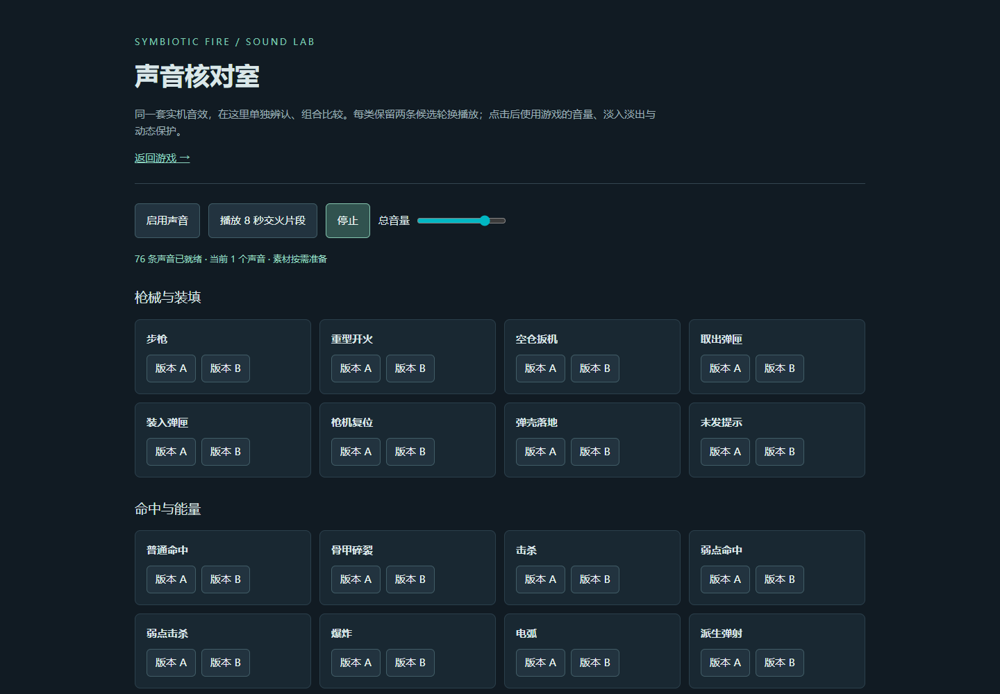
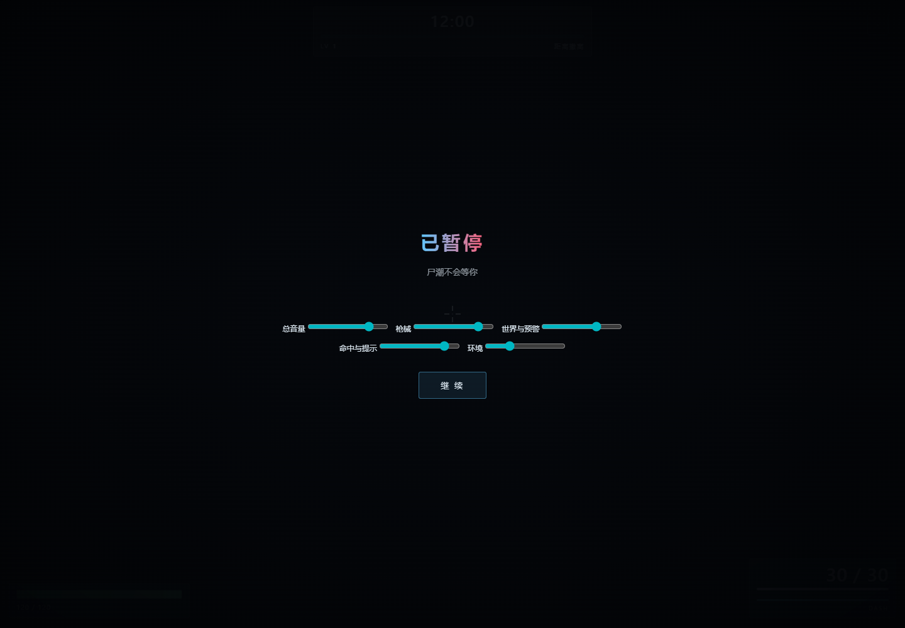
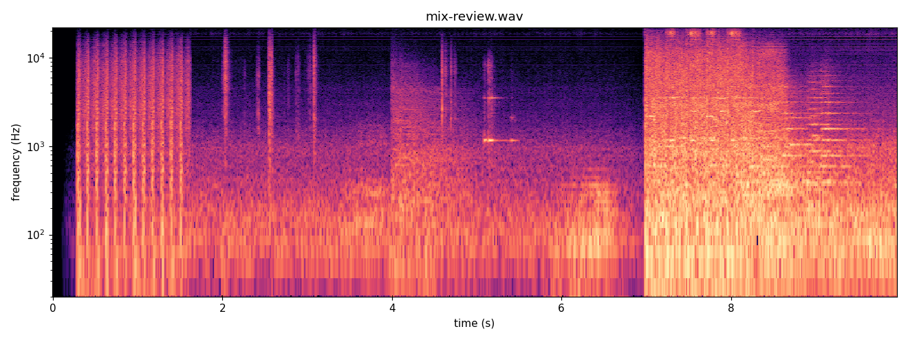

# 音效升级与验收

本轮将游戏的主要音效接入本机 Stable Audio 3 生成素材：**38 类、每类 2 个变体，共 76 条**。枪械、换弹、命中、弱点、破甲、爆炸、电弧、怪物预警、补给、进化、胜负提示均已接入，并新增脚步、落地、近处怪物低吼和废城风声。

[打开声音核对室](../../_audio-art.html) · [进入游戏](../../index.html)

核对室提供逐条 A/B 点播、8 秒交火组合和停止按钮。游戏中按 Esc 可以调节总音量、枪械、世界与预警、命中与提示、环境音量，设置会保存在当前浏览器。

## 生成和筛选

- 使用 `H:\GitForm\AIGA\tools\audio` 的现有生成器、检查器和原始 `contract.json`，没有安装新依赖，也没有修改共享工具。
- 第一批 `prompts.txt`：small-sfx / 12 步 / 每类 3 个确定性种子，共 114 条。
- 检查发现一条环境声动态不足；额外起音检查发现部分枪机、装匣、冲刺、预警、护盾破裂起音过晚。
- 第二批 `prompts-retry.txt`：针对五类问题每类再出 6 个种子，共 30 条。新提示词强调立即起音，拒绝的素材保留在本地 source 目录，没有手工修补或降低门槛。
- 144 条候选中，19 条被原始硬门或附加的起音/收尾检查淘汰；从余下候选每类选取 2 条。`source-check.json` 明确保留原始整批 **fail** 状态，不把含残次品的候选批次说成通过。
- 游戏资产是原始合格 WAV 的字节复制；`selection.json` 记录种子、SHA-256、起音、自然收尾及选取依据。播放端跳过短前导空白并做音量包络，源文件没有被修音。
- AIGA 生成器会把时长取整，最短 1 秒；附加检查按实际推理时长核对，保留提示词原始请求和有效时长记录。

## 混音和性能

- 枪械、命中确认、危险预警、普通世界音、界面提示和环境音分通道。普通世界声不能占用枪械和预警的并发配额。
- 高频同类事件合并，按通道回收旧声源；最大并发 42。声源结束后断开播放、增益和定位节点。
- 连射尾音跟随射击间隔收短，保留每一发的起音；换弹沿用真实取匣、插匣和枪机动画的触发时刻。
- 空间音使用单声道定位、距离衰减和远处剔除；不同变体轮换，避免连续选中同一条。
- 所有通道经过总动态保护与软限幅。音量变化平滑过渡，总静音准确到零。
- 风声在自然素材之间做 1.5 秒交叉淡化；暂停和隐藏页面停止活动声源。主观循环接缝听感尚未验证。
- 76 个原始素材合计约 18.2 MiB；除环境外共用单声道解码缓存，最终音频缓存约 23.6 MiB。模型权重和未选中素材不进入游戏发布内容。
- 下载/解码完成前或资源加载失败时，保留原有合成声音作为补位，不阻止进入游戏。

## 已完成的客观验收

| 项目 | 结果 |
|---|---|
| 最终资产 `check_audio.py` | 76 / 76 通过，退出 0 |
| 格式 | 44.1 kHz、立体声、PCM 16-bit |
| 附加检查 | 时长、有限数值、起音、收尾、文件来源 |
| 浏览器解码 | 76 条全部成功，无音效资源请求错误 |
| 极端混音 | 9,500 次压力请求合并/限流，最大 42 声；浮点峰值约 0.956，PCM 削波率 0 |
| 左右定位 | 左源左声道、右源右声道能量均超过另一侧 10 倍 |
| 实机事件 | 开火、换弹、脚步、落地、暂停清理通过 |
| 故障与设置 | 合成补位、音量保存、刷新恢复、总静音通过 |
| 核对室 | 38 张声音卡、A/B 按钮、停止按钮、390px 布局通过 |
| 既有回归 | `_todo13check.html` ALLPASS |

`runtime-check.json`、`ui-check.json`、`asset-check.json` 和 `mix-check.json` 保存报告。`mix-review.wav` 为真实浏览器音频图离线渲染：前 7 秒是连续射击、换弹、预警和补给等组合，**7 秒后故意叠加极端压力事件，不代表正常游戏混音**。渲染截止时仍有三个计划尾音/环境声未结束，实际停止清理另外单独检查通过。

频谱已经目视复核：步枪起音与衰减清晰，连续射击段有独立瞬态；极端叠加段没有数字削波。频谱不证明音源材质或主观听感正确。

## 验收边界

**没有完成主观人耳听感验收。** 当前环境不能可靠地让我直接听见并判断声音；不会把数字指标或频谱冒充“听过、好听”。音源是否像真实枪械、怪物声音是否合适、连续游玩是否疲劳、循环接缝是否可闻，仍属于主观待听项。已经完成全部可执行的素材、混音和实机功能检查，不因此中断接入工作。

本轮没有引入 BGM，也没有修改战斗、碰撞、导航和进化参数。历史长局移动检查的旧失败项仍见 [上一轮场景审核](../city-finish/REVIEW.md)，没有把它们计为通过。

## 复现

使用 AIGA 现有 Python 环境执行两份 prompts，主种子分别为 `20260915`、`20260916`，输出到本目录 `source/`。运行 `check_audio.py` 得到 `source-check.json`，再运行 `select.py`。选取脚本不接受硬门失败素材，并要求每类至少两条合格结果。

使用已有 Playwright/Chrome（通过 `PLAYWRIGHT_MODULE`、`CHROME_EXE` 指定），在本地 HTTP 服务上运行 `verify.cjs` 和 `verify-ui.cjs`。它们调用真实 Web Audio API，并保存混音和验收报告。测试时修改的音量设置位于临时浏览器，不改用户浏览器偏好。
