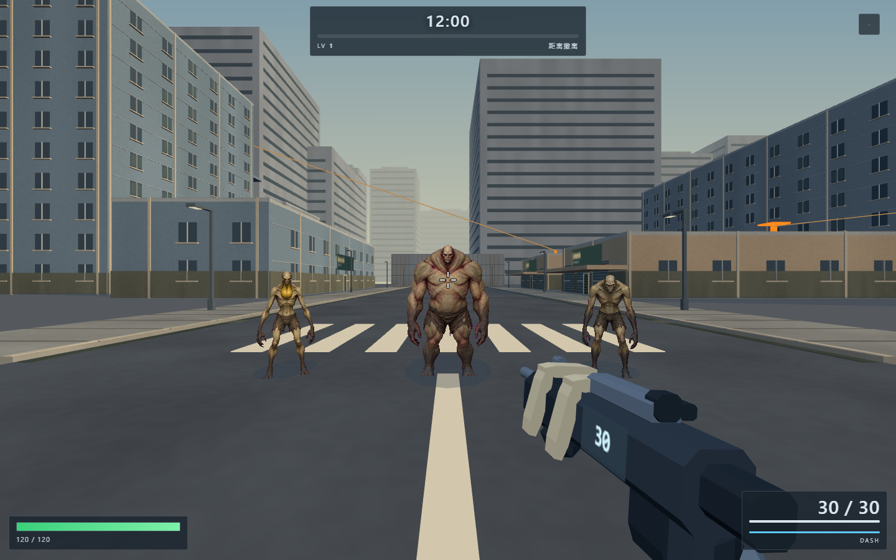
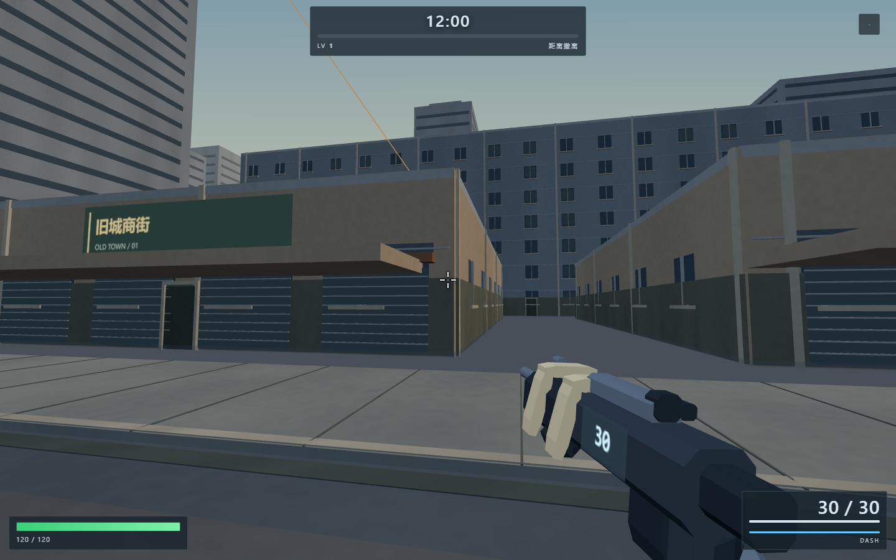
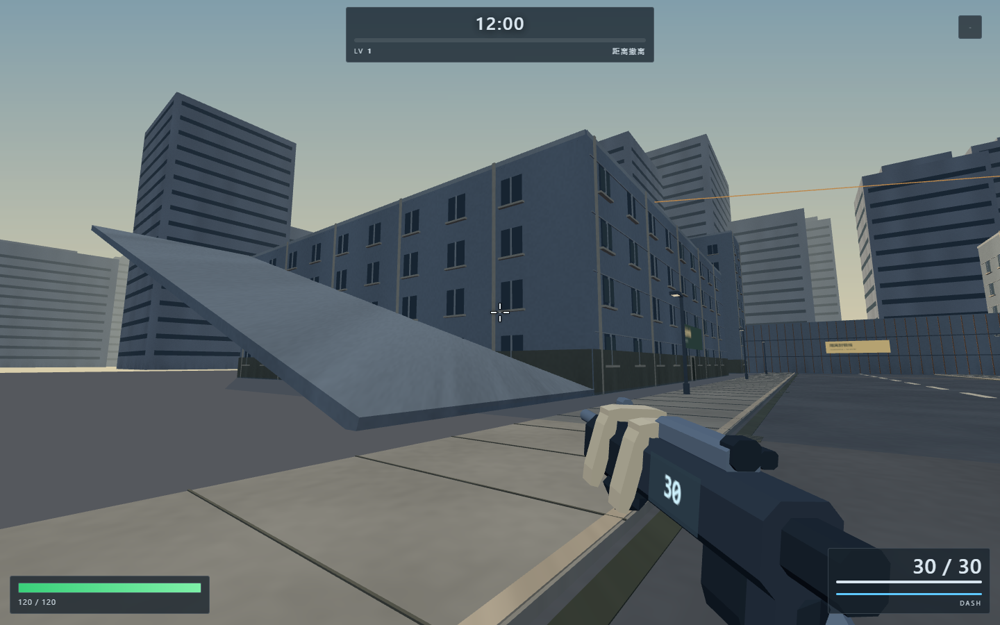
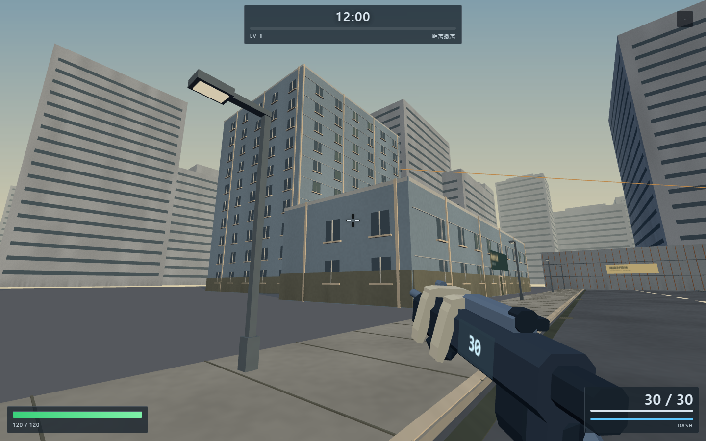
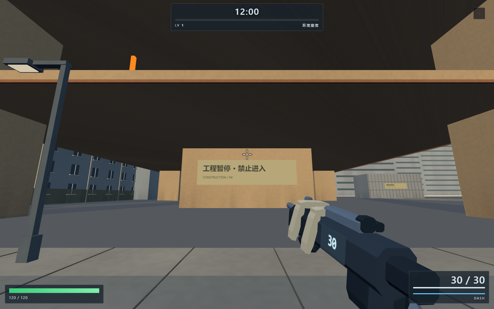

# 场景与怪物整体融合

本轮沿用已审核的 15 类怪物三视图，不更换角色身份；继续使用 2.5D 方向资产。

## 改动

- 建筑：四面基座、竖向立柱、窗台、窗框和部分积尘玻璃；商铺卷帘与旧城、停车楼、办公区标识。
- 道路：铺装接缝、路沿、排水沟与地漏；路灯改成深色细杆和独立灯头。
- 远景：楼层窗带和顶部退台；已有封锁碰撞体补集装箱筋条与隔离标识。
- 表面：共享着色器的低频风化、地面磨损及近地污渍，避免每块装饰单独绘制。
- 怪物：增加上身呼吸、行走侧摆、侧视步幅和攻击蓄力压身；提高环境光参与度，保留脸部可读性。
- 修正旧场景中离开建筑墙面的独立门板。新的关闭门安装到实际墙面，不作为可进入的门。
- 滑索改为细线渲染，保留两端橙色上索装置，避免近处的粗方管充满画面。
- 施工核心筒标识与楼板边线、停车楼顶停车线；远景窗带改成双三角形面片以压低几何开销。
- README 修正为通过 HTTP 打开，说明实际存在的角色资产依赖。

## 边界

本轮是现有游戏的整体美术整理，不代表完整三维角色或 Godot 迁移完成。方向图仍离散切换；动作仍为网格形变而非完整逐帧/骨骼动画。保留已有碰撞、导航、路线与战斗参数。

新增立面细节通过现有材质批次合并；文字招牌少量独立绘制。无新增下载依赖、动态光源或全屏后期效果。

## 自审

截图放在 `runtime/`。检查街道远近层次、四个街区标识、门板位置、怪物脚底与面部，以及侧面摆动和攻击压身。自动验证结果见 `verification.json`；900 只怪物记录仅为渲染复杂度检查，不是低配设备的帧率保证。

本轮修复 `_scalecheck.html` / `_movecheck.html` 缺少的 prompt、magmark、shieldfill 等测试 UI 节点。城市尺度测试覆盖 10 条路线、420 个落点和 34 个碰撞体；动作实测为地面冲刺 6.13m、空冲 7.80m、跑墙 14.92m、攀升 5.01m，动作链 32m。

移动测试的 736 秒模拟无逻辑/运行时异常，但完整报告仍有 3 项失败：屋顶追兵数量、旧分层经验字段、旧构筑图文本断言。不能将该测试报告为 ALLPASS。当前报告在 `movement-verification.json`，上一提交对照在 `movement-baseline.json`。

对照 `5a48fda` 的四个被修改运行时文件重新运行后，同样出现上述 3 项失败、同样无运行时异常。基线与当前版本的动作距离一致。两个长局使用测试页各自生成的种子，不拿击杀数差异作性能或平衡结论。`movement-baseline.json` 的 scale 字段是在替换基线脚本前，对当前场景运行的完整尺度结果；首次当前报告的 scale 字段因过早读取为 PENDING，以后续完整结果为准。

最终密集场景：120 只为 187 次绘制 / 92,928 三角形；900 只为 967 次绘制 / 336,288 三角形。相比上一轮新增约 12 次绘制，远景窗带已从盒子压为平面。
