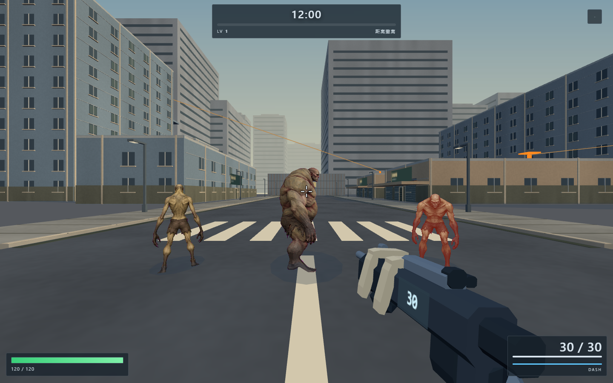
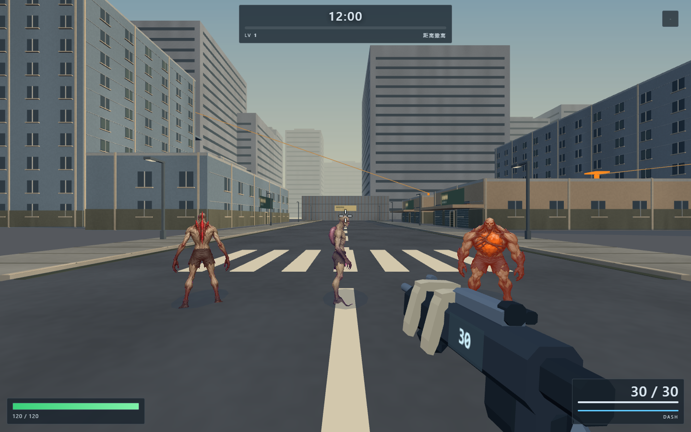
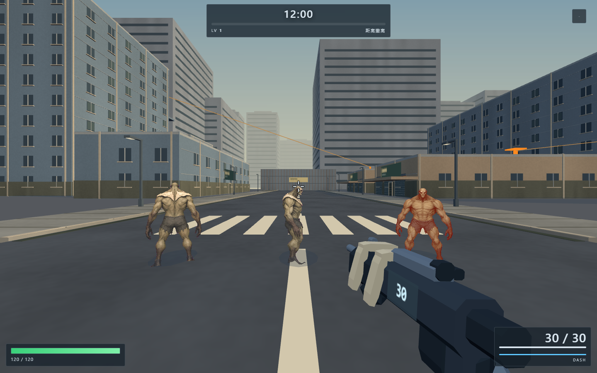

# 怪物绘制优化与实机自审

本轮保留已经审核过的 15 种方向图和三档破甲资产，优化大量怪物同时出现时的绘制开销，并修正胸口变异染色的方形边缘。角色仍是三维场景中的 2.5D 方向图。

## 改动

- 相同图集的怪物合成一次实例绘制，各自保留方向、左右镜像、步态、攻击压身、受击发光和变异颜色。
- 骨化怪物失去护甲后迁入对应图集批次；回收对象不会留下旧角色或旧批次。超出批次容量时继续单独绘制。
- 逐只检查相机视野，给形变留出包围范围；避免批量绘制让相机背后的怪物也参与绘制。
- 胸口颜色使用柔和的椭圆过渡，并按原画明暗控制强度，消除原来的矩形贴片感。
- 无新增运行依赖、纹理或动态灯光。碰撞、导航、战斗数值未修改。

## 验证

`comparison.json` 是同一暂停场景切换两种绘制方式的结果，1440×900，固定时间、位置和姿态。六组对照覆盖 15 种设计与额外三种破甲状态，包含非零步态、攻击姿态、受击发光、变异颜色与受击倾斜。每组逐像素比较，最大通道差为 2/255，没有像素超过 2 级差异。截图已经人工查看，轮廓、透明背景、遮挡和染色保持正常。

| 同场景压力对照 | 单独绘制 | 合批绘制 | 三角形数 |
|---|---:|---:|---:|
| 900 只同类 | 944 次 | 45 次 | 335,622 → 335,622 |
| 900 只混合，15 种 | 944 次 | 59 次 | 335,622 → 335,622 |

900 只混合场景的整幅画面绘制调用减少 **93.75%**。此处关闭了怪物视野剔除以隔离合批收益；另有前后视野切换、容量回退、池化换图、清空怪物检查。数字是绘制调用，不能换算成同等比例的帧率提升。

`verification.json` 另走实际开枪/换弹流程；120 / 900 只同类均为 68 次绘制，对应上一轮的 187 / 967 次。与暂停对照的调用数不同，是因为武器与效果状态不同，不能跨场景比较。

检查通过：18 张图集加载、15 种角色正面/右侧/背面/左侧选择、三次真实护甲命中、池化材质重置、开枪换弹及手部动画、行走形变、接触影回收、34 个碰撞体数量不变、`_todo13check.html` ALLPASS。浏览器无脚本和着色器错误。验证环境：Chrome / Windows / RTX 2070 SUPER。

本轮没有重跑长局移动模拟；上轮已经确认的三个旧断言失败及基线结果仍见 [场景自审](../city-finish/REVIEW.md)，不将全部历史检查宣称为通过。

## 实机截图

下列是验证场景；部分怪物被固定在攻击、受击、行走姿态以检查状态传递。







[900 只混合压力场景](runtime/mixed-900.png)。完整逐像素对照的 `individual` / `batch` 图对保存在 `runtime/`。

## 复现

通过 HTTP 运行游戏。使用已有 Node、Playwright、Sharp 和 Chrome；脚本不安装项目依赖。设置 `PLAYWRIGHT_MODULE`、`SHARP_MODULE`、`CHROME_EXE` 后运行：

```text
node art_direction/instanced-enemies/compare.cjs http://127.0.0.1:8765
node art_direction/instanced-enemies/verify.cjs http://127.0.0.1:8765
```

浏览器中可用 `ENEMY_ART.batching = false` 临时切回单独绘制进行诊断；默认为合批。刷新页面生效，无需重新配置游戏。
