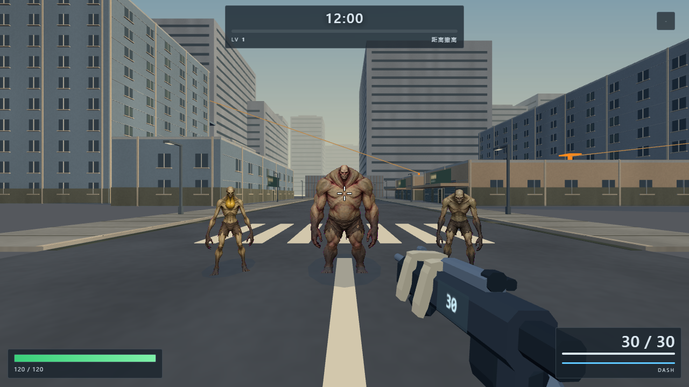
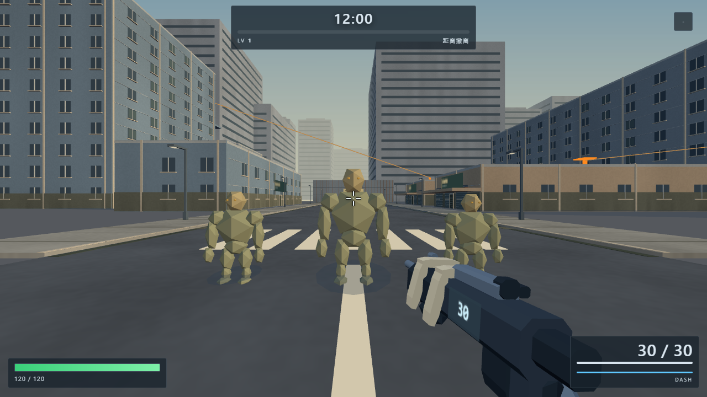

# 怪物可见性修复 · 2026-09-22

用户在 baohongjiang.com/demogames 的正式游戏中报告全部怪物隐形。

## 已确认与尚未确认

旧代码在图片尚未加载或请求失败时直接将怪物身体设为不可见，缺少错误处理和重试。旧版本注入纹理 404 后已复现：碰撞/阴影仍存在，但所有身体均不绘制。此前审核只等纹理全部加载后截图，漏掉了失败与慢加载的情况。

直接检查正式站点时，18 张怪物图均返回 200，本机 Chrome 当时可以显示怪物。因此无法断言用户那次一定是缺图；显卡兼容或缓存差异也仍是可能因素。`production-before.json` 和对应截图记录了这一边界。

## 修复

- 图片未就绪/失败时保留可见的简化实体模型，不改变怪物高度、碰撞、弱点和行为；加载成功自动恢复已有三视图原画。
- 同一纹理最多自动重试两次，避免瞬间失败让整局都没有美术。
- 检查 GPU 顶点属性、varying 与实例绘制支持；不足时自动逐只绘制，保持原画。
- 隐藏逐只身体前，实际编译并检查合批材质的链接状态；失败程序即使被多个材质复用，也必须逐只绘制。
- 页面脚本统一增加版本参数，音效索引同步换版本，避免浏览器混用旧脚本或已删除的备用音效索引。

## 验证

`verify.cjs` 覆盖 15 类怪物和 3 档额外破甲状态，逐组比较有怪物/无怪物的真实画面像素，并同时检查绘制实例数量。

通过：旧版本缺图复现、正常合批、持续加载、纹理 404、自动重试恢复、模拟 8 个顶点属性限制、故意令合批着色器编译失败、360 帧实际游戏循环。故意注入的着色器错误被单独记录，不冒充正常环境无错误。完整结果见 `verification.json`。

900 只混合怪物仍为 59 次绘制，全部 900 个实例提交成功，保留此前合批收益。

回退模型只用于美术未就绪时保证可玩性，不作为最终怪物美术。正常原画、战斗数值、导航与刷怪规则保持不变。

使用已有 Playwright / Sharp / Chrome，设置 `PLAYWRIGHT_MODULE`、`SHARP_MODULE`、`CHROME_EXE` 后运行 `node art_direction/visibility-fix/verify.cjs`。
